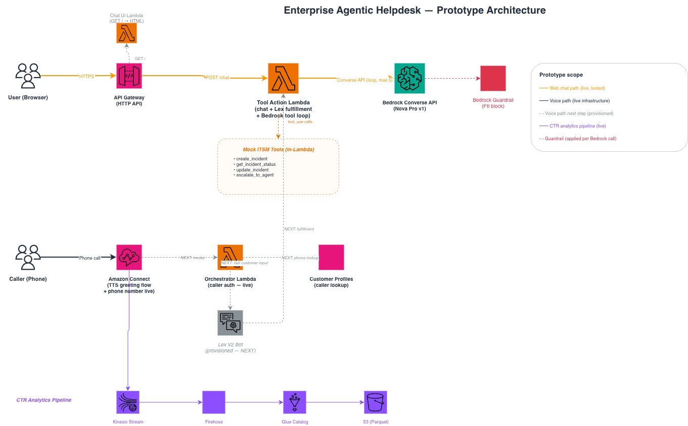

# Enterprise Agentic Helpdesk

AI-powered IT helpdesk prototype on AWS using Amazon Connect, Bedrock, Lex V2, and Terraform.



## What This Prototype Includes
- Live web chat path via API Gateway (`GET /` for the HTML UI, `POST /chat` to the AI handler)
- Tool-calling helpdesk flow backed by Bedrock Nova Pro
- Mock ITSM actions in Lambda: create incident, check status, update incident, escalate to agent
- Deterministic escalation before model invocation for high-severity / human-handoff requests
- Caller context lookup Lambda for AWS Customer Profiles
- Amazon Connect instance + phone number + greeting flow
- CTR analytics pipeline (Connect → Kinesis → Firehose → S3/Parquet via Glue)
- PII filtering with Bedrock Guardrails

---

## Now / Next / Later

> Copy-pasteable summary — used verbatim in the companion LinkedIn post.

**Now (works, tested, deployed):**
- Web chat end-to-end: API Gateway → Bedrock Nova Pro → tool calling → response
- Create / check / update ServiceNow incidents (mocked, realistic response shape)
- Deterministic escalation before the model is ever invoked
- PII guardrails on every model invocation
- CTR analytics pipeline: Connect → Kinesis → Firehose → S3/Parquet (Glue catalog, first record confirmed)
- Minimal, least-privilege IAM per Lambda

**Next (wired, one step away):**
- Voice path: Connect instance + phone number live, Lex V2 bot provisioned with fulfillment hook pointing at the same agentic Lambda that powers chat. One `create-bot-alias` CLI command and a contact flow update connects everything — no code changes needed
- Orchestrator Lambda fully built (Customer Profiles caller lookup → returns `customerName`, `customerId`, `accountTier`); Lambda permission granted to Connect — wiring it into the contact flow is a Connect console drag-and-drop (deployed but not yet in the active call path)

**Later (defined but out of scope for this prototype):**
- Real ServiceNow API calls (swap mock functions; add auth token to Secrets Manager)
- Streaming responses (`ConverseStreamCommand`) for lower chat latency
- CloudWatch alarms and dashboards
- CI pipeline: lint, test, secret scanning

---

## Designed for Extensibility

The chat path is fully functional end-to-end. The voice and ITSM paths are scaffolded and
intentionally left as stubs — the infrastructure is provisioned, the integration points are
wired, and the remaining work is well-defined. Nothing is accidental; each placeholder is a
conscious scope boundary.

### What "wired but not connected" means in practice

| Component | State | What's needed to activate |
|---|---|---|
| **Amazon Connect contact flow** | Plays TTS greeting → disconnects | Replace with a flow that invokes the Orchestrator Lambda, passes caller context, then routes to the Lex bot |
| **Orchestrator Lambda** | Fully built (Customer Profiles lookup → returns `customerName`, `customerId`, `accountTier`) | Call it from the contact flow via the *Invoke AWS Lambda* block |
| **Lex V2 bot** | Bot, locale, intent (`HelpDeskIntent`), version, IAM, and Lambda fulfillment hook all provisioned | Create bot alias (manual post-deploy step — see below); add a *Get customer input* block in the contact flow pointing at the alias |
| **tool_action Lambda (voice path)** | Full Lex fulfillment handler already implemented; shares the same Bedrock agentic loop as chat | No code changes needed — Lex will invoke it automatically once the alias is live |
| **ServiceNow integration** | Mock handlers return realistic-shaped responses; `SERVICENOW_API_URL` env var is threaded through | Replace `mockCreateIncident`, `mockGetIncidentStatus`, `mockUpdateIncident`, `mockEscalateToAgent` in `tool_action_lambda/index.js` with real `fetch()` calls; add auth token to Secrets Manager |
| **CTR analytics** | Kinesis stream, Firehose, S3 bucket, Glue catalog all provisioned; first Parquet record confirmed | Real call volume needed; query via Athena once CTRs are flowing |

### Next steps to complete the voice path
```bash
# 1. Create the Lex bot alias (requires AWS CLI v2)
aws lexv2-models create-bot-alias \
  --bot-id <BOT_ID> \
  --bot-alias-name live \
  --bot-version <VERSION> \
  --bot-alias-locale-settings '{"en_US":{"enabled":true,"codeHookSpecification":{"lambdaCodeHook":{"lambdaARN":"<TOOL_ACTION_LAMBDA_ARN>","codeHookInterfaceVersion":"1.0"}}}}'

# 2. Update the contact flow in Connect console to:
#    - Invoke orchestrator Lambda → set contact attributes
#    - Get customer input via Lex bot alias
#    - Handle escalation queue transfer
```

---

## Known Intentional Stubs

These are not bugs — they are deliberate scope boundaries, each with a clear activation path above.

| Component | Status | Activation |
|---|---|---|
| Connect contact flow | TTS greeting → disconnect | Wire orchestrator + Lex (see above) |
| Lex bot alias | Infrastructure provisioned, alias not created | One CLI command (see above) |
| ServiceNow calls | Mock handlers, realistic response shape | Swap mock functions for `fetch()` |
| Orchestrator Bedrock IAM | Pre-provisioned for future NLU enrichment | Add Bedrock call to orchestrator when needed |
| Streaming responses | IAM pre-provisioned, code uses `ConverseCommand` | Swap to `ConverseStreamCommand` |

---

## Notes
- `src/chat_ui_lambda/` only serves the browser UI for `GET /`; it has a logs-only IAM role
- `POST /chat` is routed directly to `src/tool_action_lambda/`
- `src/tool_action_lambda/` handles both API Gateway chat requests and Lex fulfillment-style events (same agentic loop, same response shaping)
- The Bedrock tool loop supports up to 5 iterations per request
- Conversation history is stored in session attributes and trimmed to the last 10 turns
- Guardrail-blocked messages are redacted before being persisted to chat history

## Repo Layout
```text
infrastructure/              Terraform for all AWS resources
src/orchestrator_lambda/     Connect hook: Customer Profiles lookup → returns caller context
src/tool_action_lambda/      Bedrock agentic loop + tool execution (chat + Lex fulfillment)
src/chat_ui_lambda/          Static HTML chat UI served from Lambda
validate.sh                  Quick health checks
test_suite.sh                Integration-style checks
```

## Quick Start
### 1) Prerequisites
- AWS CLI v2
- Terraform
- Node.js 18+
- AWS credentials with permissions for this stack

### 2) Deploy Infrastructure
```bash
cd infrastructure
terraform init
terraform plan
terraform apply
terraform output
```

### 3) Install Lambda Dependencies
```bash
cd src/orchestrator_lambda && npm install --production
cd ../tool_action_lambda && npm install --production
cd ../chat_ui_lambda && npm install --production
```

### 4) Validate
```bash
bash validate.sh
bash test_suite.sh
```

## Manual Smoke Tests
### Orchestrator Lambda
```bash
aws lambda invoke \
  --function-name <orchestrator-function-name> \
  --payload '{"Details":{"ContactData":{"CustomerEndpoint":{"Address":"+15551234567"}}}}' \
  --cli-binary-format raw-in-base64-out \
  /tmp/orch-response.json
cat /tmp/orch-response.json
```

### Tool Action Lambda
```bash
aws lambda invoke \
  --function-name <tool-action-function-name> \
  --payload '{"inputTranscript":"Create a ticket for VPN issue","sessionState":{"sessionAttributes":{},"intent":{"name":"HelpDeskIntent"}}}' \
  --cli-binary-format raw-in-base64-out \
  /tmp/tool-response.json
cat /tmp/tool-response.json
```

### Chat API
```bash
curl -X POST <chat-api-endpoint> \
  -H "Content-Type: application/json" \
  -d '{
    "inputTranscript": "Please escalate this billing dispute to an agent",
    "sessionState": {"sessionAttributes": {}, "intent": {"name": "HelpDeskIntent"}}
  }'
```

## Security Notes for Public Repos
- Do not commit `terraform.tfstate` or any secrets
- Keep real account IDs, phone numbers, and endpoint IDs out of docs
- Use environment variables for runtime configuration

## Production Hardening Checklist
- Replace mock ITSM handlers with real ServiceNow API calls + Secrets Manager auth
- Implement streaming responses (`ConverseStreamCommand`) for lower latency
- Add CloudWatch alarms and dashboards
- Add CI checks for linting, tests, and secret scanning

## License
Provided as-is for demonstration and learning.
